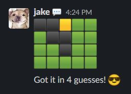
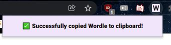
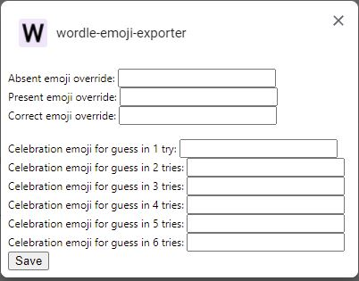

# wordle-emoji-exporter

<p align="center">
   
</p>

Export your [Wordle](https://www.powerlanguage.co.uk/wordle/) results to your
clipboard for easy integration into Slack. Published as an extension
in the Google Web Store.

One-click access via the extension icon:
<p align="center">
   
</p>

Customize your emoji of choice in the options menu:
<p align="center">
   
</p>

## Local Development

1. [Enable 'Developer Mode'](https://developer.chrome.com/docs/extensions/mv3/faq/#faq-dev-01)
   for extensions on your local Chrome.

2. Install the local dependencies (and [`nvm`](https://github.com/nvm-sh/nvm) if needed).
```
nvm use
npm install
```

3. Build the manifest locally and update it.
```
npm run build
```

4. You will need to repeatedly refresh the extension during development.

## Publishing

```
mkdir -p dist
npm version ...
npm run publish
```

This will create a `dist/${name}-${version}.zip` file which will be need
to be manually uploaded to the Chrome Web Store. Screenshots are available
in the `images/` directory.
